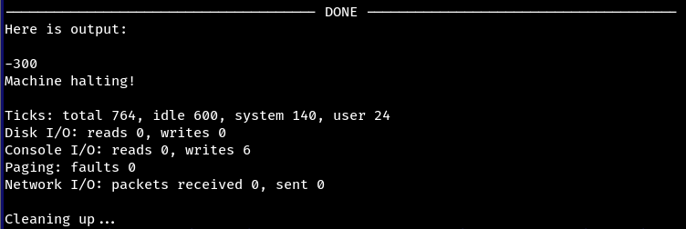

# 1. Compile Nachos

- Đầu tiên phải đến thư mục chứa nachos, sau đó cấp quyền cho nachos bằng:
```bash
chmod 777 -R nachos
```

- Sau đó vào thư mục ```code```, nằm ở ```nachos/nachos-3.4/code``` và chạy file ```test.sh```, file này thực hiện cả hai nhiệm vụ là **compile nachos** và chạy **testFunction** thử.
```bash
bash test.sh
```

- Ngoài ra để test các file trong thư mục code, ta chạy file ```run.sh``` tại thư mục ```code``` kèm với tên file mà ta muốn test.
```bash
bash run.sh <tên file>
```

# 2. Viết exception cho Nachos

> **Lưu ý:** Để dễ hơn, việc test các function mà ta đã viết sẽ được thực hiện trong hàm ```testFunction```.

1. Thêm exception mà ta định viết vào ```syscall.h``` nằm ở thư mục ```code/userprog```. Ví dụ ta muốn viết hàm ```PrinInt()``` thì sẽ thêm:
```cpp
#define SC_Halt		0
...
#define SC_PrintInt 12
...
```
Dưới đây là quy tắc ```define``` cho các hàm tương ứng:
```cpp
#define SC_Halt			0
//System call cho Thao tac
#define SC_Exit			1
#define SC_Exec			2
#define SC_Join			3
//Syscall cho thao tac tep tin
#define SC_CreateFile	4
#define SC_Open			5
#define SC_Read			6
#define SC_Write		7
#define SC_Close		8
//Syscall cho multithreading
#define SC_Fork			9
#define SC_Yield		10
//Syscall co ban
#define SC_ReadInt		11
#define SC_PrintInt		12
#define SC_ReadChar		13
#define SC_PrintChar	14
#define SC_ReadString	15
#define SC_PrintString	16
#define SC_Seek			17
#define SC_Sum			30
```

2. Kéo xuống cuối file ```syscall.h```, thêm hàm vào:
```cpp
#ifndef IN_ASM

/* The system call interface.  These are the operations the Nachos
 * kernel needs to support, to be able to run user programs.
 *
 * Each of these is invoked by a user program by simply calling the 
 * procedure; an assembly language stub stuffs the system call code
 * into a register, and traps to the kernel.  The kernel procedures
 * are then invoked in the Nachos kernel, after appropriate error checking, 
 * from the system call entry point in exception.cc.
 */

/* Stop Nachos, and print out performance stats */
void Halt();		
 
...

/*
 * Print Int
 */
void PrintInt(int input);

#endif /* IN_ASM */

#endif /* SYSCALL_H */
```

3. Ta vào 2 file ```start.s``` và ```start.s``` ở ```code\test``` để thêm các dòng này vào:
```mips
/* Start.s 
 *	Assembly language assist for user programs running on top of Nachos.
 *
 *	Since we don't want to pull in the entire C library, we define
 *	what we need for a user program here, namely Start and the system
 *	calls.
 */

#define IN_ASM
#include "syscall.h"

        .text   
        .align  2

/* -------------------------------------------------------------
 * __start
 *	Initialize running a C program, by calling "main". 
 *
 * 	NOTE: This has to be first, so that it gets loaded at location 0.
 *	The Nachos kernel always starts a program by jumping to location 0.
 * -------------------------------------------------------------
 */

...

/* PrintInt function */
	.globl PrintInt
	.ent	PrintInt
PrintInt:
	addiu $2,$0,SC_PrintInt
	syscall
	j	$31
	.end PrintInt

...
```

4. Sau đó ta sẽ viết logic cho hàm vừa mới khai báo trong ```syscall.h``` tại file ```exception.cc``` nằm trong ```code\userprog``` bằng cách thêm exception tương ứng:
```cpp
void
ExceptionHandler(ExceptionType which)
{
    int type = machine->ReadRegister(2);

    switch (which)
	{
        case NoException:
            return;
        ... // còn nhiều exception khác
        case SyscallException:
        {
            ... // còn nhiều exception khác
            case SC_PrintInt: // exception lúc nãy ta mới thêm vào
            {
                // viết vào đây
            }
        }
	}
}
```

4. Sau khi đã viết logic cho hàm (ví dụ ở đây là ```PrintInt()```), ta sẽ test nó ở trong file ```testFunction``` nằm trong ```code/test```:
```cpp
// file testFunction.c

#include "syscall.h"

int main()
{
    // chạy thử hàm PrintInt
    PrintInt(-300);
    PrintChar('\n');
    Halt();
}
```

5. Đi ra ngoài thư mục ```code```, chạy file ```test.sh``` và xem kết quả. Nếu ra như này, thì ta ok.

